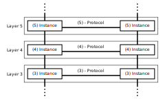

#OSI Model

**OSI Model** is a standard for the functions of communications systems into [7 abstraction layers](http://en.wikipedia.org/wiki/OSI_model#Description_of_OSI_layers). 

________________

The different layers are:

- *Layer 7:* Application Layer
    1. FTP
    2. HTTP
    3. SMTP
- *Layer 6:* Presentation Layer
    1. SSL
- *Layer 5:* Session Layer
- *Layer 4:* Transport Layer
- *Layer 3:* Network Layer
- *Layer 2:* Data Link Layer
- *Layer 1:* Physical Layer

--------

Markdown converts plain text to html tags such as `<h1>`, `<h2>`, `
`, etc.

